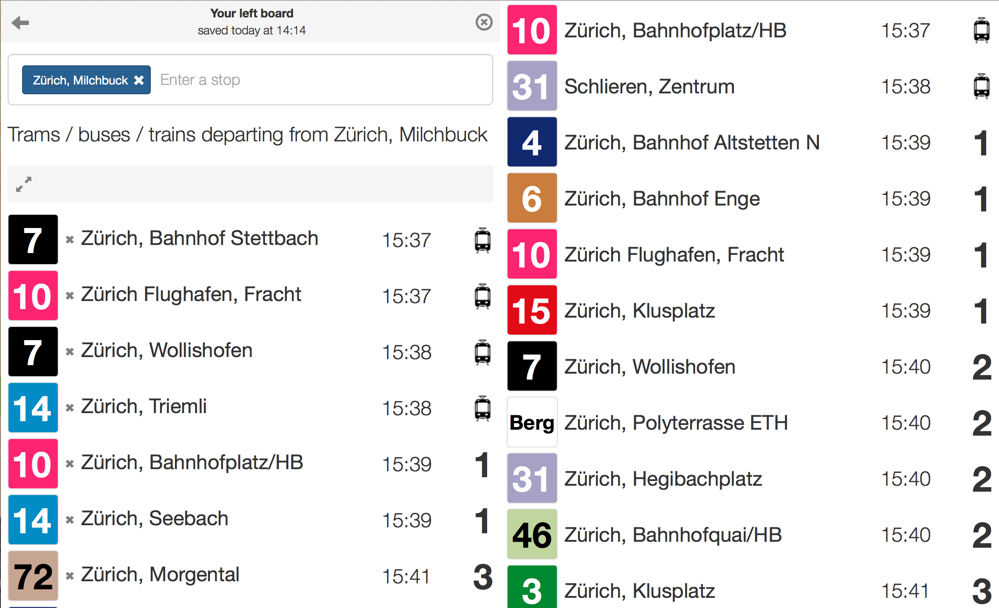

# Introduction

Tramboard is a station board for the trams and public transport in Switzerland. It is optimized to work for the city of Zurich and will indicate real-time information using the ZVV Mobile API. It will work as well for other towns in Switzerland but then the infos will not be real-time.

This is a rewrite of the original version at [Tramboard](https://github.com/fterrier/tramboard) using clojure and om.

The site is currently deployed on [http://tramboard.herokuapp.com](http://tramboard.herokuapp.com). Here is a quick look :

## How to install locally

### Prerequisites

You will need [Leiningen][] 2.0.0 or above installed.

### Running the server

To start a web server for the application, run:

    lein ring server

You also need to compile the ClojureScript and Less in order for the program to work.

### Compile ClojureScript

To compile the clojurescript, run:

    lein cljsbuild once

Alternatively you can use figwheel. That will run `cljsbuild auto` and refresh the browser with each change:

    lein figwheel

### Compile Less

To compile the Less files, run:

    lein less once

If you want to continuously deploy the changes, use:

    lein less auto

If `lein figwheel` is running at the same time, the CSS changes will be automatically reloaded by the browser.

## Production server setup

The project is setup to run on Heroku using an Uberjar containing jetty and the app. To compile the Uberjar, run:

    lein uberjar

## License

Available under GPLv3

[leiningen]: https://github.com/technomancy/leiningen
